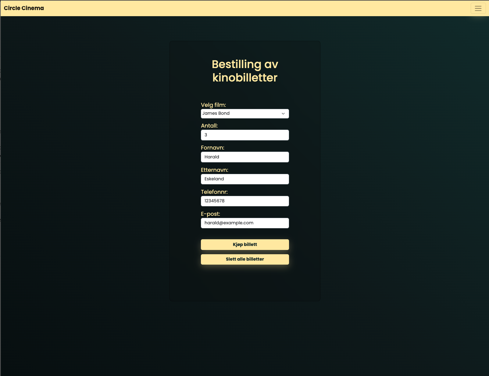
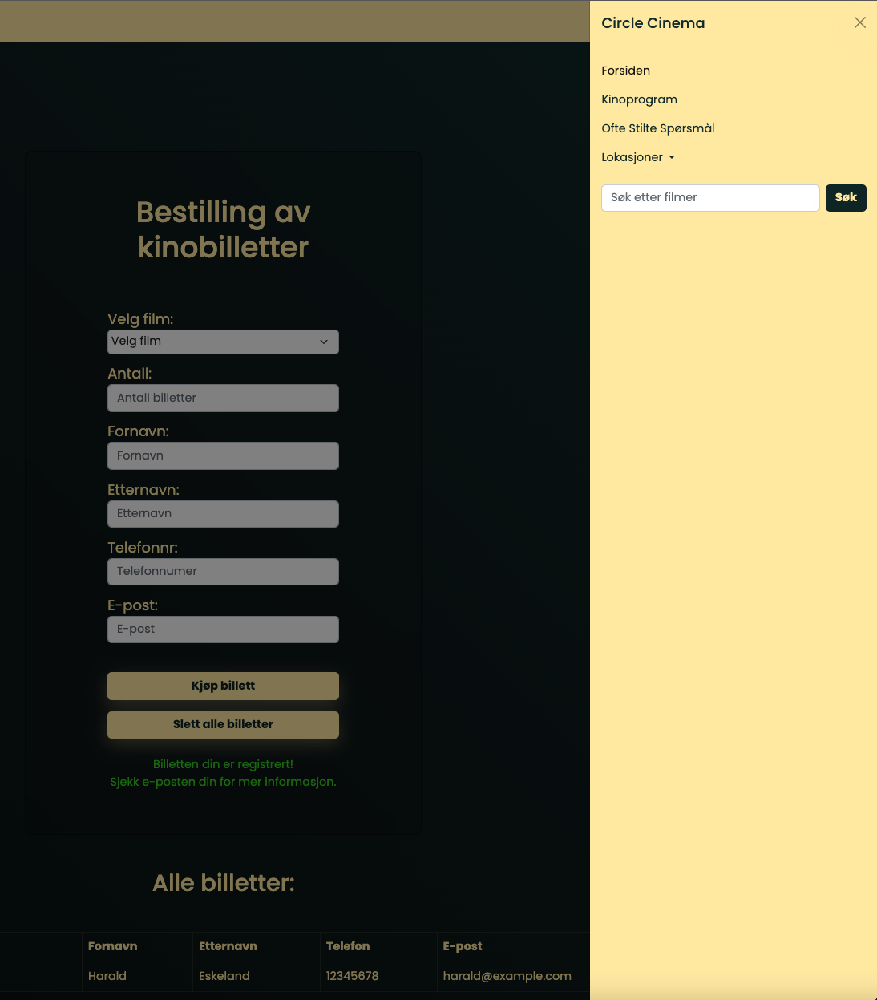
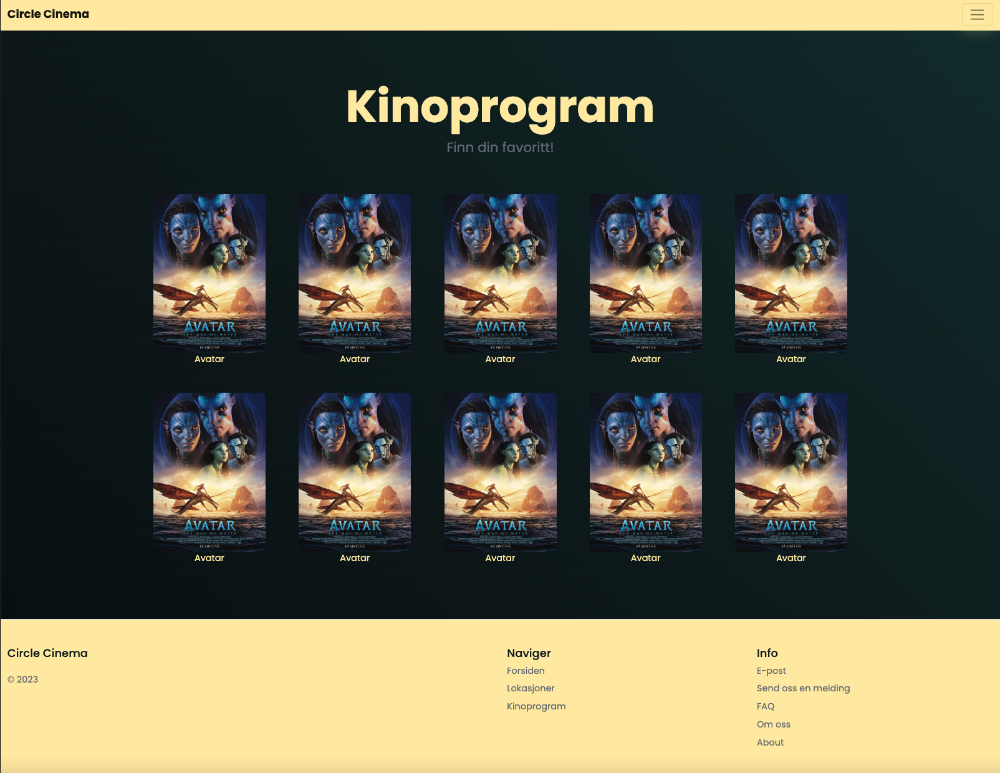
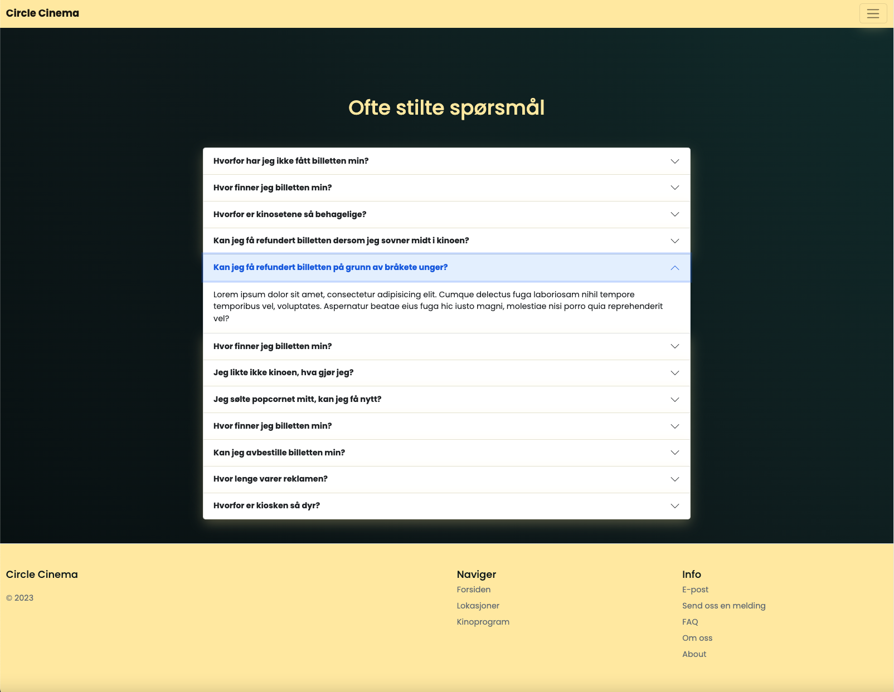

# Kino-skoleprosjekt

En skole-innlevering, som jeg gikk litt lenger enn hva oppgaveteksten ba om.   
Er en serverdel med SpringBoot som lagrer billetten på server og sender tilbake til siden og printer ut, men virker ikker her på github.  
Derfor er ikke siden veldig funksjonell her.

Foreløpig er index.html, FAQ og kinoprogram jobbet med, resten er "pynt".   

Link til nettsiden: https://haraldeskeland.github.io/Kino-skoleprosjekt/  
  
Se skjermbilder fra nettsiden her:

## Forsiden  

## Sidemeny

## Program

## FAQ

